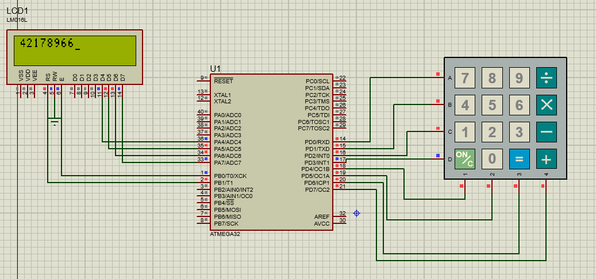

# Input Capture Unit with ATmega32 and LCD

This project implements an **Input Capture Unit (ICU)** using the **ATmega32** microcontroller to measure the frequency and duty cycle of an input signal. The results are displayed on a **16x2 LCD** in 4-bit mode. The project includes a hardware abstraction layer for LCD interfacing and a digital I/O module for flexible pin configuration. The simulation is designed and tested using **Proteus**, as shown in the provided design image.


## Table of Contents

- [Project Overview](#project-overview)
- [Features](#features)
- [Hardware Requirements](#hardware-requirements)
- [Software Requirements](#software-requirements)
- [File Structure](#file-structure)
- [Setup Instructions](#setup-instructions)
- [How It Works](#how-it-works)
- [Proteus Simulation](#proteus-simulation)
- [Usage](#usage)
- [Contributing](#contributing)
- [License](#license)

---

## Project Overview

The project uses the **ATmega32's Timer1 Input Capture Unit** to measure the period and high time of an input signal, calculating its frequency and duty cycle. The results are displayed on an LCD configured in **4-bit mode**, connected to the microcontroller's **PORTA (high pins: D4-D7)**.

The code is modular, with separate modules for:
- LCD interfacing
- Digital I/O operations
- Macro utilities

---

## Features

- Measures frequency and duty cycle of an input signal using **Timer1's ICU**
- Displays results on a **16x2 LCD in 4-bit mode**
- Configurable LCD pin connections via `LCD_Hardware_Interface.h`
- Modular code with reusable **DIO (Digital Input/Output)** and **LCD modules**
- Supports both **4-bit and 8-bit LCD modes** (configurable in header file)
- Error handling for out-of-range measurements

---

## Hardware Requirements

- **Microcontroller:** ATmega32
- **LCD:** 16x2 LCD (e.g., HD44780-compatible)
- **Signal Source:** PWM or square wave signal for input capture
- **Crystal Oscillator:** 8 MHz (defined as `F_CPU` in the code)
- **Other Components:** Resistors, capacitors, and connections as per the Proteus schematic

---

## Software Requirements

- **Compiler:** AVR-GCC
- **IDE:** AVR Studio, Atmel Studio, or any AVR-compatible IDE
- **Simulation Tool:** Proteus (for testing the design)
- **Programmer:** AVRISP, USBasp, or any compatible programmer for flashing the ATmega32

---

## File Structure
- ├── DIO_Module.c # Digital I/O module for pin manipulation
- ├── DIO_Module.h # Header for DIO module
- ├── LCD.c # LCD driver implementation
- ├── LCD_Hardware_Interface.h # LCD pin configuration
- ├── main.c # Main program for ICU and LCD display
- ├── macros.h # Utility macros for bit manipulation
- └── image.png # Proteus simulation schematic

---

## Setup Instructions

### Clone the Repository

```bash
git clone https://github.com/Ahmed2222002/Embedded-Systems.git 
cd Embedded-Systems/Input_Capture_Uint/
```

## Hardware Setup
Connect the components as follows:
- **LCD Data Pins (D4-D7)** → PORTA pins 4-7 (high pins, `IS_CONNECTED_TO_HIGH_PINS` set to 1)
- **LCD Register Select (RS)** → PORTB pin 1
- **LCD Enable (E)** → PORTB pin 0
- **Input Signal** → ICP1 pin (PD6) for input capture
- **Clock** → 8 MHz crystal oscillator

## Proteus Simulation (Optional)
1. Open the Proteus design file (refer to `image.png` for schematic)
2. Load `main.hex` into the ATmega32
3. Run simulation to verify LCD output and signal measurements

## How It Works

### Initialization
- LCD initialized in 4-bit mode using `LCD_Hardware_Interface.h` settings
- Timer1 configured for input capture:
  - No prescaler
  - Noise canceler enabled

### Signal Measurement
The ICU captures three timestamps:
1. **a**: First rising edge
2. **b**: Falling edge
3. **c**: Second rising edge

Calculations:
- **High time** = b - a
- **Period** = c - a
- **Frequency** = F_CPU / period (Hz)
- **Duty cycle** = (high / period) * 100 (%)

### Display Output
LCD shows:
- **First row**: Duty cycle (e.g., `duty:75%`)
- **Second row**: Frequency (e.g., `freq:1000HZ`)
- If invalid signal (a ≥ b or b ≥ c): displays `out of range`

## Proteus Simulation
  
The schematic shows ATmega32 connected to LCD and input signal source.

## Usage Instructions
1. Power on the circuit with ATmega32 and LCD connected
2. Apply PWM/square wave to ICP1 pin (PD6)
3. LCD will display:
   - Duty cycle (e.g., `duty:75%`)
   - Frequency (e.g., `freq:1000HZ`)
   - Invalid signals show `out of range`
